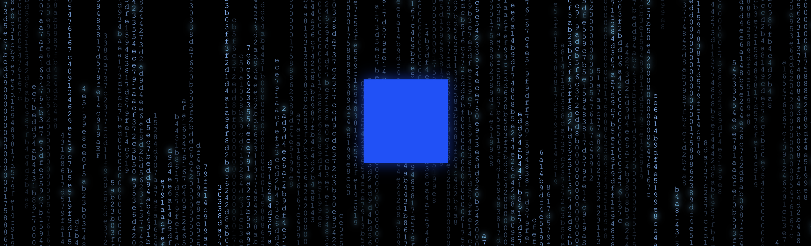

# the basetrix



*"initializing with blockchain data... the basetrix has you..."*

The Basetrix is a visualization of realtime Base chain activity using a Flashblocks-aware Base Node RPC endpoint.

Watch the digital rain of actual transactions, blocks, and addresses flowing down your screen. Be still, and know that we're all gonna make it. Base is for everyone.

## what it does

Each falling character represents real Base chain activity. The streams show live transaction hashes, wallet addresses, block data, and gas usage from base mainnet.

each column displays different types of blockchain data:
- transaction hashes from live base transactions
- wallet addresses currently interacting on base
- block numbers, timestamps, and gas consumption
- various slices of blockchain data for visual variety

## getting started

```bash
git clone https://github.com/jnix2007/thebasetrix.git
cd thebasetrix
npm install
npm run dev
```

open http://localhost:3000, watch a new global economy unfold, and get inspired to build and create

## how it works

the app connects to base mainnet's flashblocks-aware rpc endpoint to pull real blockchain data every 10 seconds. this data gets transformed into the falling character streams you see on screen

flashblocks enable ultra-fast 200ms preconfirmations on base! learn more in the [base flashblocks documentation](https://docs.base.org/base-chain/flashblocks/apps)

when the api is unavailable, it falls back to realistic mock data so the visual effect never breaks

the animation uses pure css for smooth performance - no js interference once the streams are generated

## technical notes

built with next.js 15 and typescript. the matrix effect uses absolute positioning with css animations for each character stream. opacity varies from 0.3 to 1.0 to create depth layers.

the falling speed is calibrated for a meditative 6-10 second full-screen traverse time.

## about

inspired by the iconic matrix digital rain, this visualization makes the normally invisible activity of blockchain transactions visible and beautiful.

this lets you see Base chain activity as a living, breathing global economy
